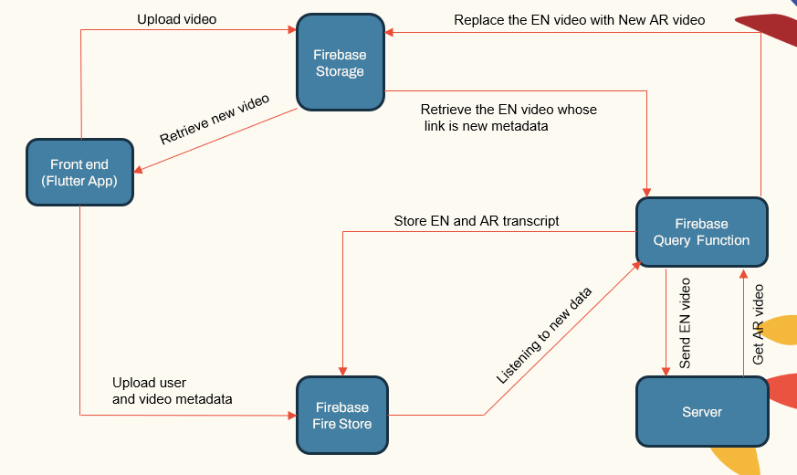
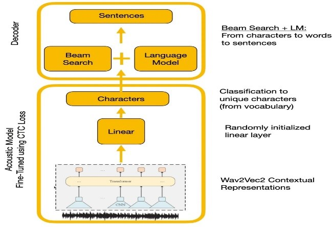
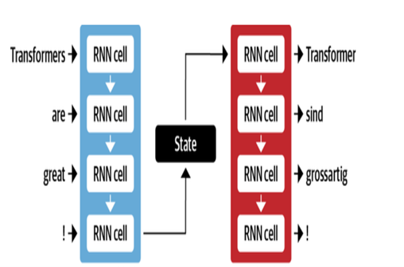
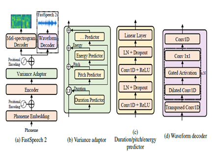

# Automatic Video Dubbing system from English to Arabic

This project presents a comprehensive study on video dubbing techniques and the development of a specialized video dubbing system. The objective is to replace the original voices in foreign language videos with the voices of performers speaking the language of the target audience, while ensuring synchronization between lip movements and the dubbed speech.

## Importance of Automatic Video Dubbing

Video dubbing aims to make video content invariant across worldwide cultures. Automatic video dubbing systems typically involve three sub-tasks:

* Automatic Speech Recognition (ASR), which transcribes the original speech into text in the source language.
* Neural Machine Translation (NMT), which translates the source language text to the target language.
* Text-to-Speech (TTS), which synthesizes the translated text into target speech.

Video dubbing enhances accessibility, engagement, and global distribution of multilingual content while preserving visual integrity for cross-cultural communication.

## Challenges

Automatic video dubbing faces several challenges:

* Lip sync accuracy
* Naturalness of dubbed voice
* Cultural adaptation and localization
* Multilingual and multicultural considerations
* Code switching.

## Methodology

The proposed methodology involves:

1. Separating the audio and video from the source English video
2. Translating the English audio to Arabic speech using a speech translator
3. Preserving the original video frames
4. Merging the translated Arabic speech with the video frames to create an Arabic dubbed video

To improve the results, two additional models are used in speech translator:

* Punctuation model to add punctuation to English subtitles
* Tashkeel model to add diacritical marks to Arabic text

|Pipeline for dubbing video ||
|-|-|
|**Speech tarnslator**||

## System Architecture

The system follows a modular architecture consisting of:

* User facing apps (Flutter app)
* Application server (localhost and herouku)
* Database server (firebase)
* Machine learning pipelines for ASR, NMT, TTS (Pytorch, Tensorflow and HuggingFace)

|System main componenet||
|-|-|

The application server handles user management, video uploads/downloads, and interfacing with the ML pipelines. The database stores user data, video metadata, transcripts, etc.

## Speech Recognition

Experiments compared Wave2Vec2.0 and Google Speech Recognition APIs. Wave2Vec2.0 gave lower Word Error Rates by pretraining on large unlabeled speech data followed by finetuning on a small labeled dataset. CTC loss function was used to train acoustic model to convert speech features into character probabilities.

|Wave2Vec2.0 with CTC decoding||
|-|-|

## Machine Translation

Google's NMT architecture utilizes LSTM layers with attention mechanism:

* Encoder LSTM converts source text into vector representations
* Attention module aligns source representations to each target word
* Decoder LSTM predicts target words sequentially based on context vectors

Key optimizations include:

1) Byte-pair encoding of words into subwords to handle rare words
2) Residual connections in stacked LSTM layers to improve gradient flow
3) Beam search decoding to reduce errors and find optimal translations

|Encoder decoder for MT||
|-|-|

## Text to Speech

FastSpeech2 is a non-autoregressive neural TTS model, allowing faster synthesis compared to autoregressive models like WaveNet during inference. The model takes text as input and predicts mel-spectrogram acoustic features using a Transformer encoder-decoder architecture. Instead of dilated convolutions, multi-layer perceptrons (MLPs) with convolutional processing are used in the model architecture. This provides local feature modeling. Additional variance predictors are incorporated to model speech attributes like pitch, duration and energy profiles. This improves prosody and naturalness.

In summary, the key aspects are:

* Non-autoregressive parallel synthesis
* Transformer encoder-decoder
* MLP layers for local context
* Variance predictors capture speech profiles

This allows FastSpeech2 to generate high quality mel-spectrograms from text in parallel during inference while maintaining natural prosody and voice characteristics.

|FastSpeech2||
|-|-|

## Results

Based on the subjective evaluations done as part of the testing process, some of the key areas identified for further improvement in translation and dubbing quality were:

* Lip synchronization: More work needed to finely tune the timing and duration of dubbed speech to better match lip movements.
* Expression: Capturing the emotion and emphasis in the original speech through appropriate intonation and prosody in the dubbed speech.
* Fluency: Some unnaturalness detected in the translated Arabic speech in terms of fluidity of sentences.
* Terminology: Domain-specific vocabulary posed challenges, especially technical jargon. Performance decreased for specialized domains.
* Speaker similarity: While multiple speaker models were created, more personalization is required to better mimic the original speaker voice.
* Background noise: Reduction of background artifacts and improvement of audio clarity for the dubbed speech.
* Grammar: Better grammatical analysis during translation required to produce perfectly coherent Arabic sentences.
* Dialectal speech: Handling informal language, dialects and slang.

## References

* [Alexei Baevski, H. Z.-r. (2020 ). wav2vec 2.0: A Framework for Self-Supervised Learning of Speech Representations. NeurIPS. META.](https://proceedings.neurips.cc/paper/2020/file/92d1e1eb1cd6f9fba3227870bb6d7f07-Paper.pdf)
* [Anmol Gulati, J. Q.-C. (2020). Conformer: Convolution-augmented Transformer for Speech Recognition. NeurIPS.](https://arxiv.org/abs/2005.08100)
* [Ashish Vaswani, N. S. (2017). Attention Is All You Need. NeurIPS.](https://papers.nips.cc/paper_files/paper/2017/hash/3f5ee243547dee91fbd053c1c4a845aa-Abstract.html)
* [Chenxu Hu1, Q. T. (2021). Neural Dubber: Dubbing for Videos According to Scripts. NeurIPS.](https://proceedings.neurips.cc/paper/2021/hash/8a9c8ac001d3ef9e4ce39b1177295e03-Abstract.html)
* [Marcello Federico, R. E.-C. (2020). From Speech-to-Speech Translation to Automatic Dubbing. Proceedings of the 17th International Conference on Spoken Language Translation (pp. 257–264). Association for Computational Linguistics.](https://aclanthology.org/2020.iwslt-1.31/)
* [Nigel G. Ward, J. E. (2022). Dialogs Re-enacted Across Languages. UTEP-CS-22-108.](https://arxiv.org/pdf/2307.04123.pdf)
* [Rong Ye, M. W. (2022). Cross-modal Contrastive Learning for Speech Translation. NAACL.](https://openreview.net/forum?id=rfGNRomMSb9)
* [Wei-Ning Hsu, B. B.-H. (2021). HuBERT: Self-Supervised Speech Representation Learning by Masked Prediction of Hidden Units. NeurIPS (p. 10). META.](https://arxiv.org/abs/2106.07447)
* [Yifan Peng, S. D. (2022). Branchformer: Parallel MLP-Attention Architectures to Capture Local and Global Context for Speech Recognition and Understanding. ICML.](https://arxiv.org/abs/2207.02971)
* [Yihan Wu, J. G. (2023 ). VideoDubber: Machine Translation with Speech-Aware Length Control for Video Dubbing. AAAI .](https://arxiv.org/abs/2211.16934)
* [klaam project](https://github.com/ARBML/klaam)
* [nemo toolkit from Nvidia](https://docs.nvidia.com/deeplearning/nemo/user-guide/docs/en/stable/starthere/tutorials.html)
* [huggingface](https://huggingface.co/docs/transformers/index)
* [The Illustrated Transformer article](https://jalammar.github.io/illustrated-transformer/)
* [The Annotated Transformer](https://nlp.seas.harvard.edu/annotated-transformer/)
* [Self-training and pre-training, understanding the wav2vec series](https://maelfabien.github.io/machinelearning/wav2vec/#)
* [BERT Explained: State of the art language model for NLP](https://towardsdatascience.com/bert-explained-state-of-the-art-language-model-for-nlp-f8b21a9b6270)