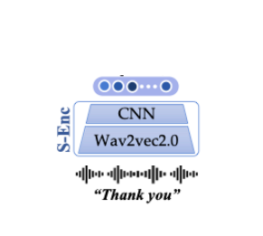
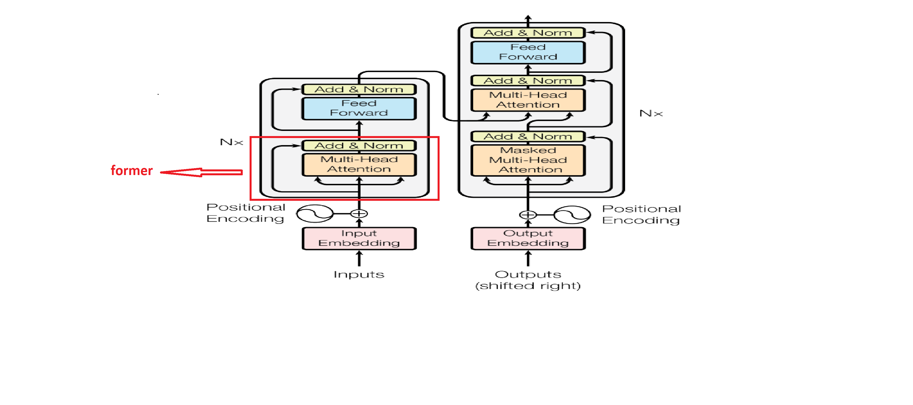
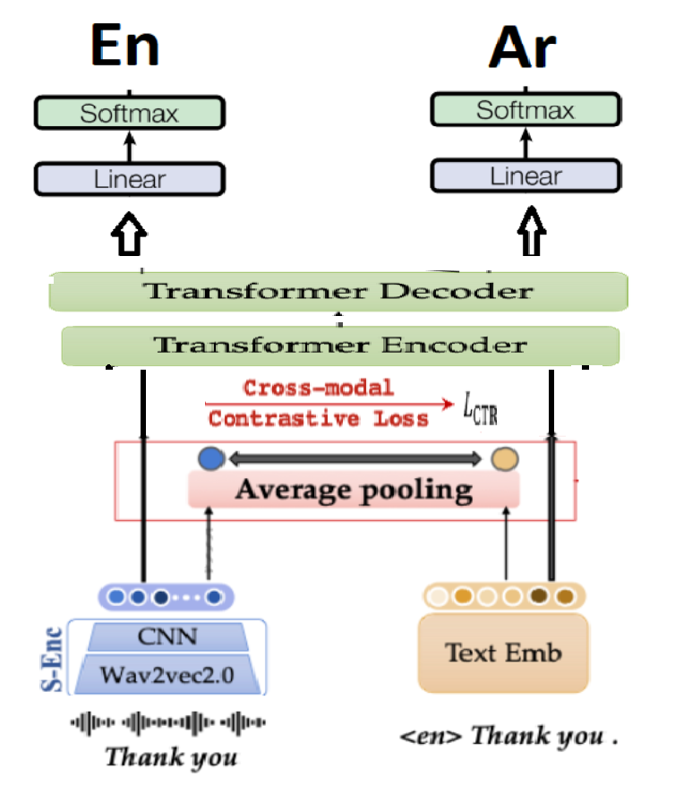

# Cross-modal Contrastive Learning for Speech Translation

This is an enhanced light implementation of NAACL 2022 paper "Cross-modal Contrastive Learning for Speech Translation" [here](https://arxiv.org/abs/2205.02444)

---

## Model architectural components

1) Wave2vec2.0 + 2 Conv1D layer for speech modal. 

2) Word Empeeding layer for text Modal. 

3) Average Pooling layer applied over the out of 1 & 2 encoders to normlize befor calculate contrastive loss between them. 

4) Transformer Encoder and Decoder As Mentioned on the paper [Attention is all you need](https://arxiv.org/pdf/1706.03762.pdf)

5) Two independant projection layeres, each layer map the output vector from decoder to task vocabulary Arabic & English. 

**All In one architecture:**

---

### Mission

Because of resources limitaion we will simplify the mentioned architecture to be more lighter, scalable and accurate to deploy on production.

We have Advantage of create each component of the model dependent from the others and pretraing it in a supervised and self supervised manner.

